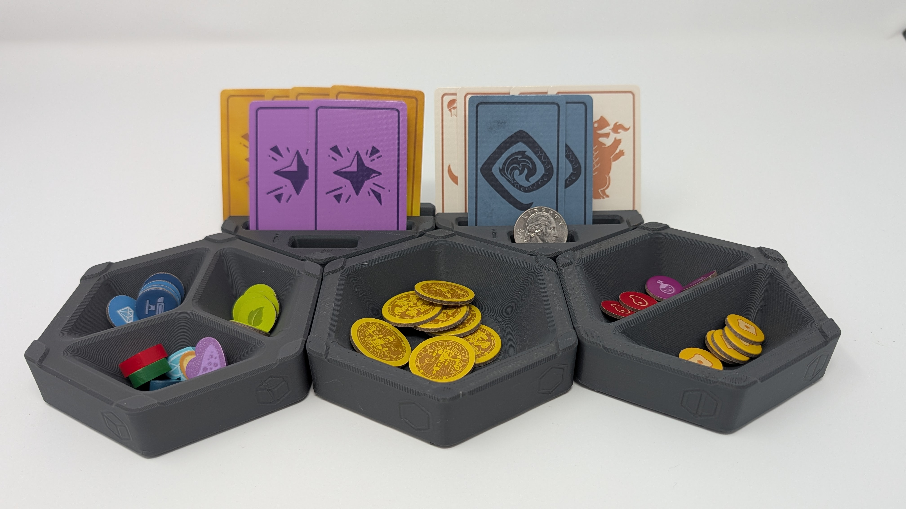

# Taking 3D Printed Products to Market (Part 1: The Direct-to-Retail Hypothesis)

A few weeks ago, I went hunting for a commercially viable 3D-printed product.

I was not looking for a casual weekend print or another novelty trinket. I was searching for a well-designed, high-utility product with a commercial retail license and a real retail revenue opportunity.

I found Hexstora: a modular tabletop gameplay organizer system designed by popular YouTube creator NeedItMakeIt, who was running a Kickstarter campaign for the project. When I saw the commercial license tier, I immediately pledged. *(Spoiler: sponsoring before working out retail pricing and competitive analysis was my #1 mistake. I talk about it in Part 4 of this series.)*

Hexstora modular trays, printed under a commercial license from NeedItMakeIt.

This felt like the ideal product to pressure-test an idea I have been working on, and an opportunity to gather some real-world data around a fundamental question: **What does it *really* take for an independent 3D designer to create a physical product and earn real, livable revenue by selling directly to retail customers and delivering products using a third-party print-on-demand fulfillment service?**

## Who I Am and the Problems We Are Solving

I am a software engineering manager by day and a designer/maker running a small 3-printer workshop by night. Over the past year, I have been focused on a painful dilemma that almost every independent 3D product designer faces.

When a designer creates an awesome product, their monetization choices are brutally limited:

1. **Surrender unsecured IP:** Sell or license raw source files (via Patreon, Thangs, or digital downloads) and watch unauthorized sellers pop up on Amazon and Etsy selling their products without credit or compensation.
2. **Become a full-time manufacturer:** Buy a dozen printers, stock rolls of filament, and spend every evening assembling parts, taping cardboard boxes, and printing shipping labels.

I believe designers deserve better control over their work so they can make a living doing what they love. Today, the moment they share an unprotected design file, they have essentially lost control of it.

If we can enable meaningful, **enforceable** controls over the usage of the design, we can put the designer back in the driver's seat so they can establish fair use, attribution, and compensation as they see fit. That would strengthen their ability to establish additional, secure income streams like:

- Selling finished physical goods on mainstream retail channels through authorized resellers, with accurate/verifiable sales data, and instant/automatic revenue share payout
- Using **secure** print-on-demand services (POD) to help them scale their business when needed without fear of unauthorized production or file leaks
- Selling protected, print-ready models directly to makers with 3D printers, and building a loyal/direct customer base

## The Two Core Questions We Are Testing

1. **The monetization teardown (Kickstarter vs. direct retail vs. secure model sales):** What are the real financial and operational trade-offs between one-time crowdfunding campaigns, selling secure print-ready models to makers, and running continuous physical retail on Etsy?
2. **The curated retail model:** Can a small print farm operator curate a high-quality physical storefront by sourcing legitimate commercial licenses from talented designers, fulfill orders on demand, and build a profitable, sustainable business that pays both the producer and the creator?

## My Real-World Sandbox (The Constraints)

I am not running an automated industrial factory. Here is what my shop floor looks like:

- **The fleet:** 3 desktop FDM printers (Snapmaker U1 and Voron class).
- **The quality standard:** Highly tuned, fast/quality print profiles, multi-color capable.
- **The capacity wall:** A strict limit on open orders to avoid shipping delays or quality degradation.
- **The financial rule:** Every single job must pay a living labor wage ($25/hr baseline), cover machine wear, reimburse packaging, and leave a genuine profit margin.

## Transparency and Disclosure

To be completely upfront: I build LMNT, the fulfillment tooling under test. This case study is an active stress test of that system with live product listings on Etsy.

My intention with this series is to learn in public, and share what it actually takes to bring a commercially sourced 3D printed product to market. My hope is that it will help designers and print farms answer the question I see regularly on Reddit: **Can I make a living in 3D printing?**

I invite full critique and thoughtful discussion around the economics and methodology presented.

## What This Series Will Cover

- **Part 2:** Design sourcing and pre-production (magnets, slicing, and the hardware reality)
- **Part 3:** The distribution fork in the road (subscriptions vs. direct retail POD)
- **Part 4:** The real cost of a 3D print (full transparent unit economics)
- **Part 5:** From product staging to automated retail (photography, webhooks, and no STL leaks)
- **Part 6:** The first real order (end-to-end fulfillment and shop floor logs)
- **Part 7:** Retail vs. Kickstarter with real receipts (the final verdict)

## Field Notes for Designers and Print Farms

- **For designers and creators:** Direct physical retail does not mean you have to buy 20 printers to drive order production and fulfillment. There is a viable path to earning recurring, passive royalties on your physical designs while keeping custody of your source files.
- **For print farm operators:** Running a sustainable printing business means moving away from commoditized $2 trinkets. Partnering with designers on high-utility products and setting fair minimum labor/production baselines is how you build predictable monthly revenue.

**Discussion question:** For creators who design 3D models, what has been your biggest hesitation with selling physical prints directly on Etsy? And for print farm operators, what is your minimum hourly or per-job threshold to take on multi-part assembly work?
